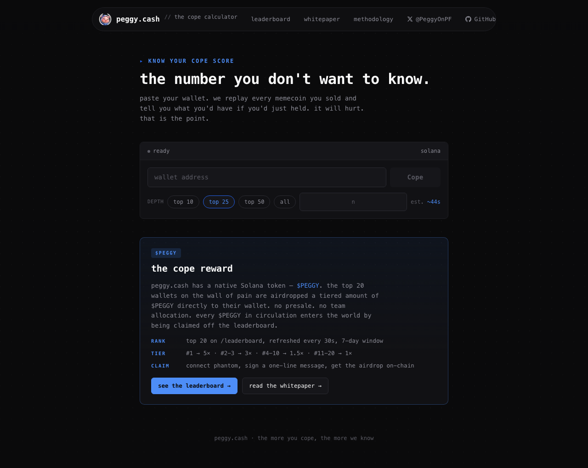

<h1 align="center">peggy.cash</h1>

<p align="center"><em>the number you don&apos;t want to know.</em></p>

<p align="center">
  <a href="https://peggy.cash"></a>
  <a href="LICENSE"></a>
  
  
  
  
</p>

<p align="center">
  
</p>

a public, on-chain regret calculator for Solana memecoin traders. paste a wallet, get back two
numbers — **peak cope** and **diamond cope** — that quantify how much SOL you fumbled by selling.
the worst sellers land on a global leaderboard (the **wall of pain**) and the top 20 can claim a
tiered `$PEGGY` airdrop directly from the site.

- **live:** [peggy.cash](https://peggy.cash)
- **whitepaper:** [peggy.cash/whitepaper](https://peggy.cash/whitepaper) — full design doc with
  architecture, tokenomics, and the security model
- **methodology:** [peggy.cash/methodology](https://peggy.cash/methodology) — the math, the
  exclusions, what we can and can&apos;t see

---

## what it does

1. **score a wallet** — fetches your Solana memecoin trades, finds each token&apos;s ATH, and
   computes how much SOL you&apos;d have at the peak vs. how much you actually walked away with.
2. **roast the receipt** — surfaces the worst single sell, worst aggregate fumble, biggest
   ATH-to-sell multiplier, shortest hold, and the single calendar day with the most cope.
3. **rank the worst** — every scored wallet lands on a global 7-day leaderboard sorted by peak
   cope.
4. **reward the worst** — top 20 wallets can connect Phantom, sign a one-line message, and claim
   tiered `$PEGGY` directly to their wallet.

## quick start

```bash
git clone https://github.com/1RubinaSingla/Peggy
cd Peggy
npm install
cp .env.example .env
# set SOLANA_TRACKER_API_KEY in .env  (everything else is optional)
npm run dev   # http://localhost:3000
```

the scoring pipeline works with just the Solana Tracker key. without the rest, the app falls
back to an in-memory cache (no share URLs across restarts) and hides the airdrop claim card.
nothing breaks.

## environment variables

| var | required | purpose |
|---|---|---|
| `SOLANA_TRACKER_API_KEY` | yes | scoring pipeline — pulls PnL, ATHs, prices, trades |
| `UPSTASH_REDIS_REST_URL` | no | persistent cache: receipts, leaderboard, claim records |
| `UPSTASH_REDIS_REST_TOKEN` | no | upstash auth |
| `AIRDROP_ENABLED` | no | `true` to activate the claim flow |
| `AIRDROP_TOKEN_MINT` | if airdrop on | SPL mint address (base58) |
| `AIRDROP_TOKEN_DECIMALS` | if airdrop on | usually 6 or 9 |
| `AIRDROP_BASE_AMOUNT` | if airdrop on | human-readable 1× tier amount (e.g. `1000`) |
| `AIRDROP_SIGNER_SECRET_KEY` | if airdrop on | base58 string OR JSON byte array · **never commit** |
| `AIRDROP_TOKEN_SYMBOL` | no | display ticker · defaults to `PEGGY` |
| `SOLANA_RPC_URL` | if airdrop on | mainnet RPC (Helius / Quicknode strongly recommended) |

every `AIRDROP_*` var is optional. if any required one is missing or malformed, the feature
self-disables, the claim card stays hidden, and the rest of the site is unaffected.

## architecture

| layer | what |
|---|---|
| frontend | Next.js 15 app router · React 19 · server components by default |
| data plane | Solana Tracker REST API for PnL, ATHs, current prices, individual trades |
| cache | Upstash Redis for receipts (24h TTL), share-page lookup, leaderboard sorted set, claim records, rate-limit counters · in-memory fallback for dev |
| chain | `@solana/web3.js` + `@solana/spl-token` · mainnet |
| hosting | Vercel · Node 22+ runtime · streamed responses for the scoring pipeline |

the codebase is small enough to read in one sitting:

- `src/` — data layer (tracker client, scoring math, leaderboard, airdrop, signature verify)
- `app/api/` — streaming scoring endpoint, leaderboard, airdrop endpoints
- `app/` — pages and components

see the [whitepaper](https://peggy.cash/whitepaper) for the full design doc.

## contributing

PRs welcome, especially:

- bug reports on wallets where the score is clearly wrong — that&apos;s how the dust filters and
  exclusion rules get better
- new roast cards (the bar is: must be data we can compute from existing tracker fields)
- liquidity-floor checks on ATHs so dead-token peaks don&apos;t inflate scores
- trade-time SOL/USD conversion for historical accuracy
- SPL-to-SPL swap support so non-SOL-routed sells count

the math is honest, the conclusions are mean — both intentional. keep that voice.

## license

MIT · do whatever, just keep the notice. see [LICENSE](LICENSE).

---

*peggy.cash · the more you cope, the more we know*
